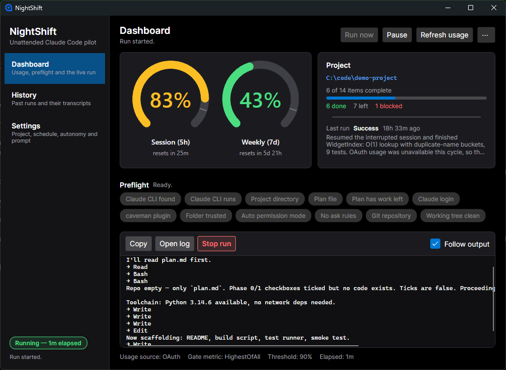
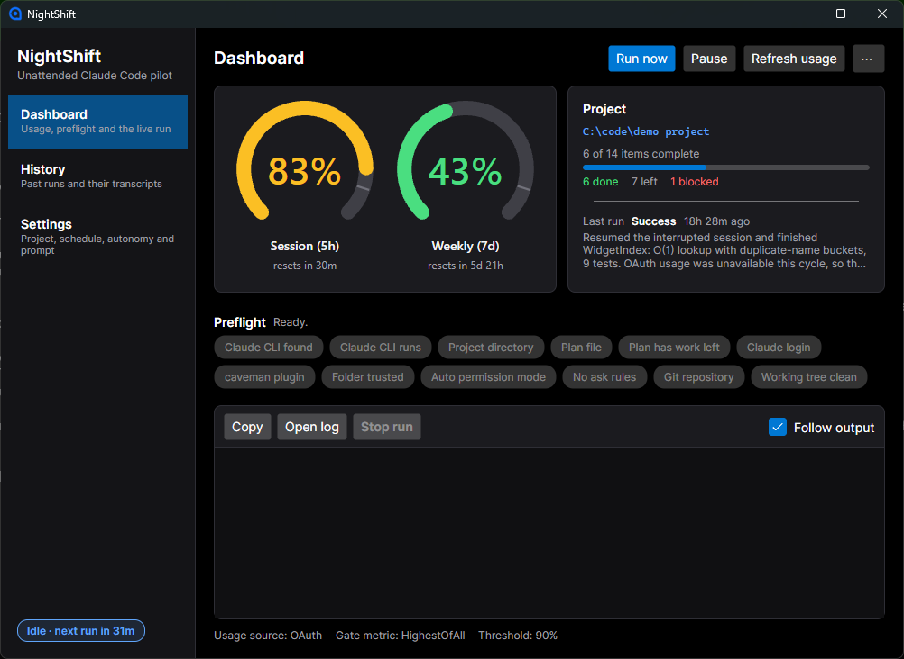
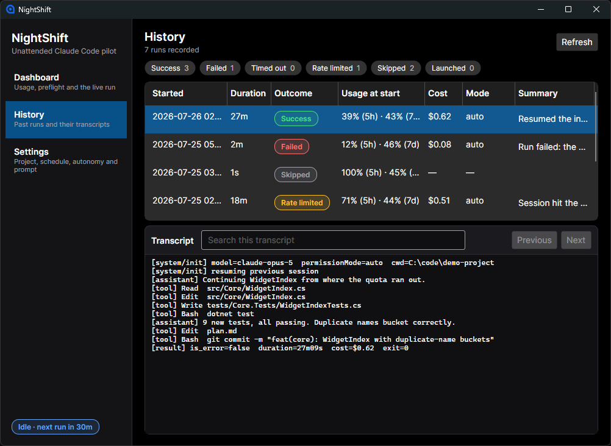
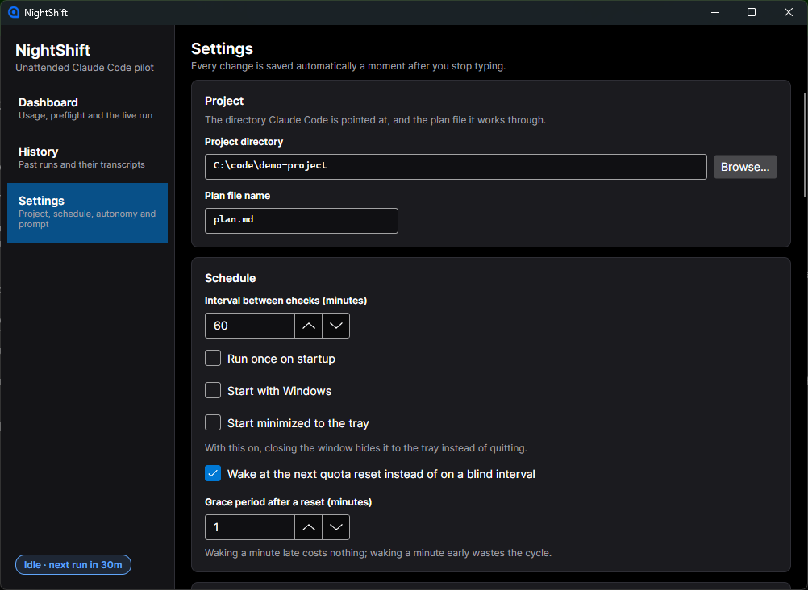
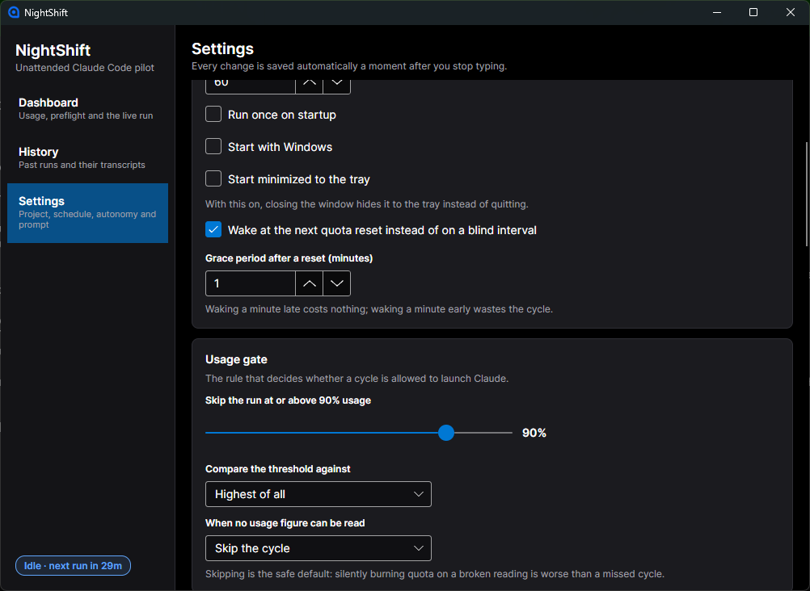

# NightShift

A Windows desktop app that babysits one Claude Code project. On an interval anchored to your
subscription's quota resets it wakes up, reads your real utilization, and — if there is headroom —
launches Claude Code in your project directory to work through `plan.md`. Everything it does is
streamed into the window and written to disk.

It is a small, single-purpose tool. Read the [risks](#what-this-is-not) before you point it at
anything you care about.



Above: a real run in progress — live 5-hour and 7-day gauges with reset countdowns, the project
card with `plan.md` checkbox tallies, twelve green preflight pills, and Claude's streamed output.

<table>
<tr>
<td width="50%"><a href="docs/images/dashboard-idle.png"></a><br><em>Idle between checks.</em></td>
<td width="50%"><a href="docs/images/history.png"></a><br><em>History: every run, and its transcript.</em></td>
</tr>
<tr>
<td width="50%"><a href="docs/images/settings.png"></a><br><em>Settings — project and schedule.</em></td>
<td width="50%"><a href="docs/images/settings-usage-gate.png"></a><br><em>The usage gate: threshold, metric, and what to do when usage cannot be read.</em></td>
</tr>
</table>

[The prompt settings](docs/images/settings-prompt.png) show the exact string a run is launched
with, including the namespaced `/caveman:caveman` command.

---

## Why you would use this

A Claude subscription's quota is a rolling allowance on a clock. The 5-hour session window rolls
over five hours after you first used it that session, whether or not you were awake. The weekly
window refills on its own cycle, again without asking. If you sleep eight hours, several windows'
worth of quota open and close with nothing spending them. That capacity does not accumulate — an
unused window is gone.

Separately, a lot of software work is *legible*: a checklist of items that a competent agent can
pick up one at a time, given a repository and a task list. That is what `plan.md` is for. It is the
authoritative list; Claude reads it, does the first unticked item, ticks it, commits, and stops.

NightShift joins those two facts. It:

- wakes on an interval (default 60 minutes) that it **pulls earlier** to land just after a quota
  window resets, so a slot is spent when the most quota is available;
- reads your **actual subscription utilization**, not token counts or dollars;
- if the selected metric is below the threshold (default 90%), launches Claude Code in your project
  directory, with the `caveman` skill applied, told to continue through `plan.md` and to never ask
  a human anything;
- streams the run into the window, writes a full transcript to disk, and records the outcome;
- if the run hits the quota wall partway through, records that as its own outcome, waits for the
  window, and **resumes the interrupted session** rather than starting over;
- if usage is at or above the threshold, skips the cycle and says why.

It is about 15,700 lines of application code against 8,100 lines of tests. There is no server, no
account, no telemetry.

### It is a reasonable fit if

- your project is a git repository with a real `plan.md` of small, independent, verifiable items;
- you would be comfortable letting an agent commit to that repository with no one watching;
- your machine is on overnight anyway;
- you are on a Claude subscription with a quota you routinely fail to spend.

### It is a bad fit if

- the repository contains anything you cannot afford to have modified, or secrets on disk;
- your `plan.md` items are large, ambiguous, or need a human decision partway through — an
  unattended agent will either guess or mark them `- [!]` and move on;
- you want a review gate before anything lands. There isn't one. Commits happen while you sleep;
- you are on a metered API key rather than a subscription. The usage gate measures subscription
  utilization; it will not stop you spending money.

---

## What this is not

Read this part. It is the reason the app defaults to skipping rather than running.

**It runs Claude Code unattended, with a broad tool surface, against your repository.** The default
allowed tools are `Bash,Read,Edit,Write,Glob,Grep`, and under `auto` permission mode that list is
not even the limit — a run in the acceptance test used `Read, Write, Edit` *and* `PowerShell`.
There is no human in the loop by construction: `--disallowedTools AskUserQuestion` removes Claude's
ability to ask, stdin is closed so anything that tries to read input gets EOF, and the prompt
explicitly instructs it never to seek confirmation. Whatever it decides to do, it does.

The project directory should be a git repository whose history you are willing to have written to.
Preflight warns if it is not one, but only warns.

**`auto` mode is not a sandbox.** Claude Code's `auto` permission mode runs a separate classifier
over each action and blocks things that are irreversible, destructive, or aimed outside your
environment. That is meaningfully better than nothing, and it is why it is the default here. It is
not isolation. An agent with `Bash` and write access to your repo can still do real damage inside
the blast radius the classifier considers legitimate.

**`bypassPermissions` has no classifier at all.** It is exposed in Settings as
*"Trust fallback: skip permissions entirely"*, off by default, behind a red warning. Anthropic's own
guidance is isolated VMs only. Treat that toggle as meaning "I would be fine if this repository were
deleted."

**The primary usage source is an undocumented endpoint.** The real quota percentage comes from
`GET https://api.anthropic.com/api/oauth/usage`, which is community-discovered, not documented by
Anthropic, and can change shape or disappear without notice. Every field is parsed defensively and a
200 response with no recognisable windows is treated as *unavailable*, not as 0%.

**The fallback is only an estimate, and it is not close.** When the endpoint fails, NightShift falls
back to `ccusage`, which reads local transcript files and reports tokens against an inferred ceiling.
Measured on the same 5-hour window on 2026-07-26: the OAuth endpoint reported **14%**, ccusage
reported **41.18%**. Acting on the estimate would have skipped runs through most of a night that had
86% of its session quota free. Snapshots from this provider are marked approximate, and the gauge
shows an "approximate" chip. Do not read that number as a quota percentage.

**`seven_day.resets_at` is not when your quota comes back.** It reports when the *oldest tokens age
out of the rolling window* — roughly seven days ahead — while the counter itself resets on a
~72-hour cycle, measured across three consecutive cycles at **71.9h, 72.6h and 72.5h**. Weekly
utilization has separately been observed dropping **60% → 2%** while `resets_at` still claimed nine
hours in the future. None of this is documented.

NightShift's scheduling is built to survive that. Reset alignment only ever moves a check *earlier*,
so a too-distant timestamp is simply never chosen. The one place a check moves *later* — the wait
after a run is cut short by quota — is capped by `MaxQuotaWaitHours` (default 6, clamped 1–72). A
usage check costs one cached HTTP call; re-checking early is strictly cheaper than sleeping for four
days on a wrong timestamp. **Do not remove that cap.**

**Percentages are rounded.** The endpoint appears to report whole numbers, while the run stream's
own `rate_limit_event` carries an unrounded fraction for the same window minutes apart. Threshold
comparisons against the endpoint are accurate to about ±0.5 percentage points.

**Windows only.** The core library is platform-neutral and macOS credential reading is implemented,
but only Windows is tested and shipped.

---

## Getting it

### Prerequisites

| Requirement | Notes |
|---|---|
| Windows | 10/11. Only Windows is tested. |
| .NET 10 SDK, or the .NET 10 runtime | Pinned to SDK `10.0.302` (`rollForward: latestFeature`) in `global.json`. A published build is framework-dependent and needs only the runtime. |
| Claude Code, installed and logged in | Verified against 2.1.220. Run `claude` once and sign in, so `~/.claude/.credentials.json` exists. |
| The `caveman` plugin | `claude plugin marketplace add JuliusBrussee/caveman` then `claude plugin install caveman@caveman`. Preflight can run both commands for you. |
| A git repository containing `plan.md` | The plan file name is configurable; the default is `plan.md`. |
| `git` on `PATH` | Only for the two git preflight checks. Its absence is a warning, not a blocker. |

### Download a build

Every push to `main` produces a `NightShift-win-x64` artifact on the
[Actions tab](https://github.com/donaldsteele/NightShift/actions) — a single framework-dependent
`NightShift.Desktop.exe` of roughly 33 MB. Tagged versions (`v*`) additionally produce a GitHub
release with the same binary and a `SHA256SUMS.txt` to verify it against.

Either way you need the [.NET 10 desktop runtime](https://dotnet.microsoft.com/download/dotnet/10.0)
on the target machine; the build is framework-dependent, not self-contained.

The publish command, if you want to produce it yourself:

```
dotnet publish -c Release -r win-x64 --self-contained false /p:PublishSingleFile=true
```

The `Release` configuration strips managed and native symbol files and bundles the native libraries;
without that the same command emits about 133 MB across five files, ~120 MB of which is `.pdb` files
for libraries nobody debugs. CI fails if that regression ever comes back.

### Build and run from source

```
git clone https://github.com/donaldsteele/NightShift.git
cd NightShift
dotnet build
dotnet run --project src/NightShift.Desktop
```

`dotnet test` runs 659 tests across two projects. The build treats warnings as errors, so a clean
build is the real gate.

### First run

1. **Settings › Project › Project directory** — pick the git repository containing your `plan.md`.
   Everything else has a working default.
2. Go back to **Dashboard** and look at the preflight strip. Every pill should be green.
3. Press **Run now** once, while you are sitting there, and watch the output pane. Confirm it reads
   `plan.md`, does something, and commits. Do not leave it unattended until you have seen one run
   end cleanly.

Preflight runs at startup, whenever settings change, and before every scheduled run. Twelve checks,
in order:

| Pill | Red means | Fix offered |
|---|---|---|
| Claude CLI found | Not on `PATH` or in any known install location. The probed paths are listed under the pill. | Set the path by hand |
| Claude CLI runs | `claude --version` failed to start, timed out, or exited non-zero. | — |
| Project directory | Not set, or the directory is gone. | Folder picker |
| Plan file | No `plan.md` (or your configured name) inside it. | Create a starter plan file |
| Plan has work left | *Amber only.* No `- [ ]` boxes remain, so a run would burn a slot for nothing. | Open the plan file |
| Claude login | No credential, or it has expired. | Login instructions |
| caveman plugin | The plugin is missing, or does not provide the `caveman` command. **This one matters — see below.** | Run the two install commands |
| Folder trusted | *Amber only.* Headless runs on 2.1.220 do not consult the trust flags; a visible terminal does. | Write the trust keys |
| Auto permission mode | *Amber only.* `auto` is unavailable on this account/model, so runs fall back to `acceptEdits`. | Re-probe |
| No ask rules | A `permissions.ask` rule or an interactive MCP server exists. These are evaluated *before* the classifier and always force a prompt, which hangs an unattended run until the stall detector kills it. | Open the offending settings file |
| Git repository | *Amber only.* Not a git repo, so a bad run is not recoverable. | `git init` |
| Working tree clean | *Amber only.* Uncommitted changes will be mixed in with the run's own commits. | — |

The scheduler gates on red only. Amber never stops a run.

---

## Operating it

### The settings that matter

Settings save automatically a moment after you stop typing. There is no OK/Cancel.

| Setting | Default | Why you would change it |
|---|---|---|
| **Interval between checks** | 60 min (5–1440) | This is an *upper bound*, not a metronome. With reset alignment on, checks are pulled earlier to land just after a window rolls over. |
| **Wake at the next quota reset** | on | Turn off for a strict interval. |
| **Grace period after a reset** | 1 min (0–60) | Firing exactly on the boundary races the server's clock and reads the window that is about to close. |
| **Threshold** | 90% (50–100) | Run only if the selected metric is *strictly below* this. At 89 it runs; at 90 and 91 it skips. |
| **Compare the threshold against** | Highest of all | `max(5h, 7d, 7d-opus, 7d-sonnet)`. The safe choice — it will not start a run that immediately burns the weekly cap. `Session 5h` and `Weekly 7d` narrow it to one window. |
| **When no usage figure can be read** | Skip the cycle | The other option is *Run*. Skipping is the safe default: silently burning quota because a scrape broke is the worst failure mode this app has. |
| **Permission mode** | `auto` | Falls back to `acceptEdits` automatically if `auto` is unavailable on your account. `bypassPermissions` is a deliberate third rung with no classifier. |
| **Launch mode** | Headless (logged) | *Visible terminal* opens a real interactive window in the project directory and copies the prompt to the clipboard, but the app cannot capture output; those runs record as `Launched` with no transcript. |
| **Session strategy** | Fresh session each run | Fresh keeps context small, which matters when the point is conserving quota — `plan.md` carries the continuity. A session cut short by quota is resumed regardless of this setting. |
| **Max run duration** | 55 min | Sized so a run cannot outlive a 60-minute slot. On timeout the process tree is killed and the run records as `TimedOut`. |
| **Stall timeout** | 10 min | No stream event for this long means a hidden prompt or a hung tool. Separate from the overall timeout. |
| **Dry run** (Advanced) | off | Goes through the entire cycle, logs the exact resolved command line, and never spawns Claude. Use this first if you are unsure what will be executed. |
| **Runs to keep in history** (Advanced) | 200 | Pruned on startup; dropped runs' transcripts are deleted with them. |

Everything lives under `%APPDATA%\NightShift\`: `settings.json`, `state.json` (next run time,
pending resume, quota deadline), `logs/nightshift-*.log`, and `runs/` (an append-only
`index.jsonl` plus one `<runId>.log` transcript per run). Advanced has an **Open app data folder**
button. Access tokens are redacted before anything reaches a log file, and there is a test asserting
a token-shaped string never reaches the sink.

### Remote control

Optionally, a launched session can start with Claude Code's Remote Control enabled and named after
the repository, so you can pick it up from another device. Turn it on in Settings > Autonomy; leave
the name blank to use the repository name (taken from the `origin` remote, or the directory name).

**It only works in visible-terminal launch mode.** In headless mode Claude Code accepts
`--remote-control` and silently ignores it: exit 0, no error, and nothing about remote control in
the session's `init` event. Rather than pass a flag that looks like it worked, NightShift does not
pass it at all in headless mode, logs a warning, and shows an amber preflight pill plus a note in
Settings. Switch the launch mode to **Visible terminal** to actually use it.

Note the trade-off before switching: terminal runs are recorded as `Launched` and nothing more —
no streamed output, no cost, no success or failure, no mid-run quota detection, and no stall
detector, because NightShift cannot see inside a window it does not own.

### Run now, Force run, Stop run

- **Run now** starts a cycle immediately but **still honours the usage check**.
- **Force run** (behind the `⋯` overflow, red, confirmation required) bypasses the usage check. It
  can deliberately burn a weekly cap.
- Neither reprograms the schedule. A manual action must not silently change the cadence.
- **Stop run** stops whichever run is in flight, whether this window started it or the background
  scheduler did. A manual run is cancelled through the token the window holds; a scheduled run goes
  through `PilotScheduler.StopCurrentRun()`, which cancels that cycle's own linked token. Either
  way the process tree is killed and the run is recorded as "Stopped by the user." rather than
  leaving an unexplained gap in the history.

---

## When usage detection breaks

### `Unavailable` and what happens next

`Unavailable` means *every* configured provider failed. The gauge draws a dotted ring with a dash —
deliberately never `0%`, because 0% reads as "plenty of quota left" and would invite exactly the
run this state exists to prevent. The scheduler then applies **When no usage figure can be read**,
which defaults to **Skip**. If you flip it to *Run*, a broken scrape costs you a night of quota
instead of a night of nothing.

### Diagnosing it

Start with the **Usage source** line at the bottom of the Dashboard (`OAuth`, `Ccusage`, or `None`)
and the app log in `%APPDATA%\NightShift\logs\`.

**The login expired or was rejected.** The provider surfaces
`Claude login expired — run 'claude' and re-authenticate.` before spending an HTTP call, or
`Claude rejected the stored OAuth token (401) — run 'claude' and re-authenticate.` after one. A 401
is latched against a fingerprint of that specific token, so it never retry-storms; re-authenticating
clears the latch without restarting the app. The fix is to run `claude` in a terminal and sign in
again. Credentials are read from `%USERPROFILE%\.claude\.credentials.json` on Windows and Linux, and
from the login Keychain (`security find-generic-password -s "Claude Code-credentials" -w`) on macOS.

**Rate limited (429).** The endpoint has known reports of persistent 429s. NightShift backs off
1 min → 5 min → 15 min → 30 min, honours a longer `Retry-After` up to 30 minutes, and falls back to
`ccusage` in the meantime. It never spins.

**The endpoint changed or went away.** This is the failure the app is designed to outlive. Switch
**Advanced › Usage provider order** to `Ccusage only`, accept that the figure is an estimate — and
remember the 14% vs 41.18% measurement above before trusting the threshold. If you do this, consider
raising the threshold, or narrowing the metric, rather than leaving a 90% gate on a number that can
be three times too high.

### Falling back to ccusage deliberately

The default command is:

```
npx ccusage@latest blocks --json --token-limit max
```

**Do not add `--active`.** `max` means "the highest previously observed block", so resolving it
needs the full block history — and `--active` filters that history away. ccusage then emits no
`tokenLimitStatus` and no `tokenLimit` at all: no error, just a missing field, and the whole fallback
path silently produces nothing. NightShift picks the active block out of the array itself. An
explicit numeric limit such as `--token-limit 500000` *does* survive `--active`, so a hand-written
override may legitimately use both. Override the whole command in **Advanced › ccusage command
override**; it replaces the invocation entirely rather than appending to it.

---

## Two things that will silently break a run

Both of these fail *without* an error. That is what makes them worth a section.

### The slash command must stay namespaced

The prompt begins with `/caveman:caveman full`. Measured against Claude Code 2.1.220:

```
claude -p "/caveman full\n\nReply with exactly: FORM-A-OK"
  → result "Unknown command: /caveman",  is_error false, exit code 0
claude -p "/caveman:caveman full\n\nReply with exactly: FORM-B-OK"
  → result "FORM-B-OK",                  is_error false, exit code 0
```

With the unnamespaced form the **entire prompt is swallowed**. Nothing runs, no tools are used, no
files change — and Claude Code reports success with exit code 0. The first attempt at this project's
Phase 3 acceptance test did exactly that: 1 second, $0, zero text deltas, repository untouched, and
the run recorded as **Success**. An unattended pilot would have burned every slot all night doing
nothing, with a clean-looking history.

Plugin commands are registered as `<plugin>:<command>`; there is no bare alias. Two defences are in
the code: the runner treats any result beginning `Unknown command:` as a **failed** run naming the
likely cause, and preflight checks for the namespaced command before a run rather than discovering
the problem from a wasted night. If you edit the prompt template, do not touch that first line.

### `--bare` must never be used

Bare mode skips discovery of skills, plugins, hooks, MCP servers and `CLAUDE.md`, *and* skips
OAuth/keychain auth. It would break both the caveman skill and subscription authentication at once.
It is the single most likely mistake in a build like this, so a test asserts the constructed
argument list never contains `--bare` — and never contains `plan`, the permission mode that ends by
waiting for a human.

---

## How a cycle actually decides

1. Pilot enabled? Otherwise `Skipped(Disabled)`.
2. A run already in flight? Otherwise `Skipped(AlreadyRunning)`. Runs are never queued — a run that
   outlasts its interval simply makes the next tick skip.
3. Preflight has no red rows? Otherwise `Skipped(PreflightFailed)` with the failing check named.
4. Fetch usage (cached 60s). Unavailable → apply the *When no usage figure can be read* setting.
5. `metric >= threshold` → `Skipped(OverThreshold)`, and the next check is anchored to the
   **blocking** window's reset, not the earliest reset overall.
6. Otherwise, run.

If the run is cut short by quota, the outcome is `RateLimited` — not `Failed`, because nothing is
broken. The reset time and the resumable session id are persisted to `state.json`, so a machine
restarted at 3 a.m. still knows it must not launch until the window is actually back, and still
resumes the half-finished session when it is.

Rate-limit detection deliberately never inspects assistant message text. This repository's own plan
discusses rate limits on nearly every page, so a run against it produces prose, commit messages and
diffs full of the words "rate limit", "429" and "usage limit". A bare substring match would mark
healthy runs as quota-blocked and stall the pilot for hours.

---

## Status

All six phases of `plan.md` are complete: scaffolding, settings and persistence, usage providers,
execution, scheduler and preflight, UI, and hardening. 659 tests pass (553 Core, 106 Desktop) and
the build runs with warnings as errors.

CI builds and tests every push on a Windows runner and guards the published output against
regressing to the 133 MB, five-file version. Tagging `v*` drafts a release with the single-file exe
and its SHA256.

`plan.md` is the authoritative design document and carries the corrections that reality forced —
several of the things this app does are the opposite of what the plan originally specified, and each
reversal is recorded there with the measurement that caused it.

---

## License

[PolyForm Noncommercial 1.0.0](LICENSE.md). Free for any noncommercial purpose: personal projects,
research, study, hobby work, and use by charities, schools, public research and government bodies.

**Commercial use requires a separate license** — contact the author. This is source-available, not
OSI open source; restricting commercial use is precisely what OSI approval forbids, so calling it
"open source" would be inaccurate.

One edge worth naming: "noncommercial" is fuzzy for contractors. Using NightShift on client work you
are paid for is commercial use.
