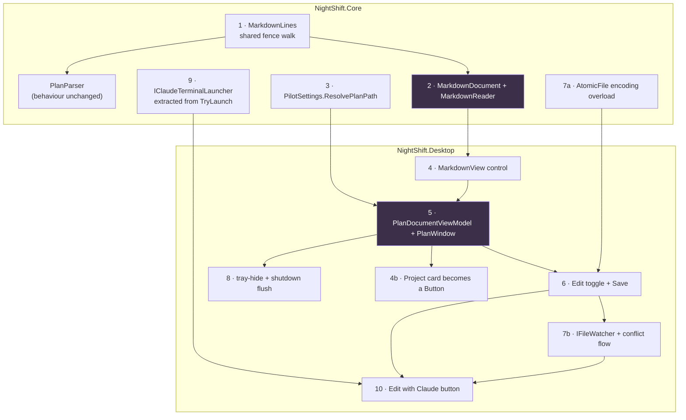

# In-app plan viewer and editor

## Context

NightShift is built around one file — `plan.md` in the project directory — but the app gives
you no way to look at it. The dashboard's Project card renders the tally as a dead read-out:
a summary line, a progress bar and three counters at
`src/NightShift.Desktop/Views/DashboardView.axaml:144-156`, none of it clickable. The only
route to the file is the "Open the plan file" preflight fix, which shells out to the OS
default handler (`DashboardViewModel.cs:711-719` → `IShellLauncher.OpenPath`), and that pill
is only offered when the plan has zero items or zero remaining items
(`PreflightChecker.cs:914`, `:936`). On a healthy plan there is no way to open the plan from
inside the app at all.

This adds a plan window: click the plan progress on the Project card, read the plan as
rendered markdown, edit it in place, save it back, and optionally hand it to an attended
Claude session in plan mode.

---

## Corrections to the draft (verified against the tree at `74d4e13`)

Three of the draft's premises are wrong, and two of them change the work:

1. **The "Edit with Claude" seed prompt as drafted cannot ship.** It contains `- [!]`, and
   `!` is one of the five hazards in `ProcessArguments.CommandShellHazards`
   (`['%','!','"','\r','\n']`, `ProcessArguments.cs:45`). Both launch paths in
   `TerminalClaudeRunner.TryLaunch` route through `cmd /k` (`:230` and `:244`), so the draft's
   own proposed test — `Assert.False(HasCommandShellHazard(prompt))` — would fail on the
   draft's own prompt text. Also worth knowing: **`HasCommandShellHazard` currently has no
   production caller at all**; it exists and is tested, but `TryLaunch` hand-concatenates its
   cmd line without consulting it. §10 below fixes both.

2. **`AtomicFile` cannot preserve a BOM.** `AtomicFile.WriteAllTextAsync`
   (`src/NightShift.Core/Io/AtomicFile.cs:14`) calls `File.WriteAllTextAsync(tempPath, contents)`
   with no encoding argument — that is UTF-8 **without** a BOM, always. The draft says "write
   through `AtomicFile`" and separately "preserve encoding + BOM"; those are contradictory
   today. §7 adds an encoding overload.

3. **Several paths in the draft are wrong.** `PlanParser` lives in
   `src/NightShift.Core/Preflight/`, not `Plan/`; `ContentLines` is at `:274-298` (not
   `:256-279`), the marker constants at `:300-310` (not `:282-291`), `MilestoneHeadingPattern`
   at `:324` (not `:305`). `ConfirmationDialog` is in `Platform/`, not `Views/`.
   `ImmediateUiDispatcher` ships in the **app** project (`Services/ImmediateUiDispatcher.cs`),
   not the test project. `PlanItemCounts` is declared inside `PreflightChecker.cs:183-203`, not
   in `PlanParser.cs`.

What the draft got right and I re-verified independently:

- **Corpus.** This repo's `plan.md` (1163 lines): 38 headings, 65 task items, 63 bullets, 32
  numbered, **251 block-quote lines**, 23 table rows, 12 rules, 10 fences, and **0 links, 0
  images, 0 strikethrough**. Block quotes really are the dominant construct.
- **Angle brackets.** 19 lines contain `<…>`; after stripping code spans, **zero** remain. Every
  one is inside a backtick span. Raw-HTML interpretation would eat this content.
- **The CLI.** `claude --help` on the installed CLI: `--permission-mode` choices are
  `acceptEdits, auto, bypassPermissions, manual, dontAsk, plan`, and the usage line is
  `claude [options] [command] [prompt]` — "starts an interactive session by default".
- **`App.axaml` classes** all exist as claimed: `Border.notice` `:230`, `Border.code` `:239`,
  `Button.link` `:248`, `Border.pill` `:123`, `TextBlock.h1/h2/caption` `:78/:83/:88`.
- **No `FileSystemWatcher` anywhere in the repo.** This is greenfield.

Environment note: this refinement was produced in a Linux container with no .NET SDK — the egress
policy blocks `builds.dotnet.microsoft.com`, so **nothing here has been compiled or test-run.**
Every claim above is from reading the tree at `74d4e13`, measuring this repo's own `plan.md`, and
running `claude --help`. `c:\code\TrestleBoard` was not reachable either, so all corpus figures are
from NightShift's own `plan.md` — which on its own covers every construct in the model (quotes,
tables, fences, all three task marks, milestone headings). TrestleBoard remains a good second smoke
test when you run this on Windows.

---

## Shape of the change



Data flow once built:

```
plan.md ──read──> MarkdownReader ──> MarkdownDocument ──> MarkdownView (rendered)
   ▲                                        │
   │                                        └──> raw text ──> TextBox (edit mode)
   │                                                             │
   └──AtomicFile.WriteAllTextAsync(encoding)──── Save ◀──────────┘
   │                                                             │
   └──FileSystemWatcher (dir, filtered) ──400 ms──> conflict? ───┘
                                                     │
                                              Save also re-runs
                                              RunPreflightCommand
                                              so the card's counts move
```

---

## 1. Share `PlanParser`'s fence walk

`PlanParser.ContentLines` (`Preflight/PlanParser.cs:274-298`) is the repo's single definition of
"a line outside a fenced block". The reader needs the same walk but also needs the fence
*contents* and the info string, so lift the walk rather than copy it.

New `src/NightShift.Core/Markdown/MarkdownLines.cs` — `internal static class` yielding a
`readonly record struct MarkdownLine(string Text, bool InFence, string? FenceInfo)`. It must
reproduce `ContentLines`' exact quirks, because those quirks are load-bearing:

- split on `'\n'` only, `TrimEnd('\r')` per line;
- a line whose **left-trimmed** text starts with ` ``` ` **or** `~~~` toggles the fence flag —
  the fence type is not matched, so a ` ``` ` opened and `~~~` closed still toggles, and an
  unclosed fence swallows the rest of the file;
- fence delimiter lines are themselves never content.

`PlanParser.ContentLines` becomes
`MarkdownLines.Walk(text).Where(l => !l.InFence).Select(l => l.Text)` — same sequence, same
laziness. **`PlanParser`'s public behaviour must not change**; `PlanParserTests.cs` is the guard
and must pass with **no edits**.

Note `NightShift.Core.csproj` already has `<InternalsVisibleTo Include="NightShift.Core.Tests" />`,
so `internal` is test-visible.

## 2. The markdown model and reader

`src/NightShift.Core/Markdown/` — pure BCL, no Avalonia, so it unit-tests like `PlanParser` does.
This is the bulk of the work.

**`MarkdownDocument.cs`** — the model:

```
MarkdownBlock (abstract)
 ├─ HeadingBlock   { int Level, Inlines, int? MilestoneNumber, MilestoneMarker Marker }
 ├─ ParagraphBlock { Inlines }
 ├─ ListBlock      { bool Ordered, ListItem[] Items }
 │    ListItem     { TaskMark? Task, MarkdownBlock[] Blocks }   // nested blocks, not just text
 ├─ CodeBlock      { string? Language, string Text }            // verbatim, never re-parsed
 ├─ QuoteBlock     { MarkdownBlock[] Blocks }                   // recursive
 ├─ TableBlock     { ColumnAlignment[] Alignments, Cell[] Header, Cell[][] Rows }
 └─ RuleBlock

MarkdownInline (abstract)
 ├─ TextRun   { string Text }
 ├─ StyledRun { StyleKind Kind (Bold|Italic|BoldItalic|Strikethrough), Inlines }
 ├─ CodeRun   { string Text }   // literal; no nested parsing, no HTML
 └─ LinkRun   { string Text, string Url }
```

**`MarkdownReader.cs`** — `public static MarkdownDocument Read(string text)`, driven off
`MarkdownLines.Walk`.

**NightShift facts are first-class model data.** This is the whole justification for hand-rolling
instead of taking a dependency, so it is not an afterthought:

- `TaskMark = Todo | Done | Blocked` from `- [ ]` / `- [x]` / `- [!]`. Recognised with
  `PlanParser.CheckboxPattern()` (already `internal static partial`, `PlanParser.cs:314`) so the
  viewer and the dashboard tally can never disagree about what a task item is. A generic renderer
  prints `[!]` as literal text; here it becomes a mark the view draws in `NsCriticalBrush`.
- `HeadingBlock.MilestoneNumber` and `Marker = None | Delivered | Blocked | InProgress`, derived
  from `PlanParser.MilestoneHeadingPattern()` (`:324`) and the same four `internal const`
  markers `PlanParser` already owns — `DeliveredMarker` `:301`, `BlockedMarker` `:304`,
  `StatusMarker` `:307`, `PostMilestoneStatusMarker` `:310`. Matching semantics must match
  `PlanParser.ReadMarkers` (`:221-236`): blocked is checked first, `Contains` for
  delivered/blocked, `StartsWith` on the left-trimmed line for the status markers.

**Deliberate non-goals** — state them in the file's XML docs so nobody adds them by reflex:
raw HTML (never interpreted, see the corpus finding), reference-style links, footnotes, setext
headings, block quotes nested more than one level, autolinks, entity escapes, emphasis inside
words (`a*b*c`), and lazy continuation lines. Anything unrecognised falls through as literal
`TextRun` — the correct failure mode for a document whose bytes the user is about to edit.

The repo's doc style is prose-heavy XML comments explaining *why* (see `Controls/UsageGauge.cs:10-29`
and `PromptBuilder.cs:76-96`). Match it — especially on the non-goals and on why code spans are
never re-parsed.

## 3. `ResolvePlanPath`

`Path.Combine(projectDirectory, planFileName)` is written out exactly twice today, both in
`PreflightChecker` — the read at `:835-836` (wrapped in `try/catch (ArgumentException)` at
`:837-845`) and the write at `:1374-1375` (unwrapped; the outer `ApplyFixAsync` catch at
`:1340-1366` turns a throw into `PreflightFixOutcome.Failed`). Desktop never builds a plan path;
it only forwards `fix.Target`. The plan window is the third caller, which is what justifies the
helper.

Add to `src/NightShift.Core/Configuration/PilotSettings.cs`:

```csharp
public static string? ResolvePlanPath(string? projectDirectory, string? planFileName);
public string? ResolvePlanPath();   // instance: uses Normalized()'s values
```

Returns `null` when the directory is blank or the combine throws `ArgumentException` — folding
in the try/catch `PreflightChecker` currently does inline. Migrate both `PreflightChecker` sites.

One behaviour change to accept deliberately: `PreflightChecker.cs:841` currently reports
``` `{planFileName}` is not a usable file name: {ex.Message}```. With the exception swallowed in
the helper, drop the `: {ex.Message}` tail. Nothing in the test suite asserts on that string
(grepped: the literal appears only at that one production site), and the `ex.Message` tail was
a framework string of no use to a user.

## 4. The renderer, and making the card clickable

**`src/NightShift.Desktop/Controls/MarkdownView.cs`** — a `Control`/`UserControl` subclass taking
a `MarkdownDocument` and building a panel in code. `Controls/UsageGauge.cs` is the precedent for
a code-built control here. Not XAML: the structure is recursive and data-shaped, and the csproj
sets `AvaloniaUseCompiledBindingsByDefault=true`, which nested item templates fight.

- **Blocks** → a `StackPanel` of `Border`/`TextBlock` reusing `App.axaml` classes: `h1`/`h2` for
  headings, `caption` for de-emphasised runs, `Border.code` (`:239`) for fenced blocks with
  `NsMonospace` + `NsCodeBrush`, `Border.notice` (`:230`) for quotes, `Border.pill` (`:123`) for
  milestone markers.
- **Inlines** → `SelectableTextBlock` with an `InlineCollection` of `Run`/`Span`, so a paragraph
  is one control however many runs it holds. `SelectableTextBlock` is already the output pane
  (`DashboardView.axaml:286-288`) and has a `.mono` style at `App.axaml:99`, so selection and
  copy match existing behaviour.
- **Tables** → a `Grid` with generated `ColumnDefinition`s, each cell a `SelectableTextBlock`,
  header row bold. Largest table in the corpus is 23 rows; nothing exotic needed. (Do **not**
  reach for `DataGrid` — `HistoryView.axaml.cs:59-64` records that Avalonia 12 deprecates it.)
- **Task items** → a two-column row: mark glyph (`☐` / `☑` / `⚠`, brushed subtle / `NsOkBrush` /
  `NsCriticalBrush`) and the item's inlines. **Never a real `CheckBox`** — the file is the truth,
  and a checkbox that silently rewrites the file is a different, larger feature.
- **Links** → `Button Classes="link"` (`App.axaml:248`) calling `IShellLauncher.OpenUrl`, which
  already refuses anything not http/https (`Services/IShellLauncher.cs:79-83`).
- **Performance** → build once per document load into a `StackPanel` inside a `ScrollViewer`,
  copying the inset rule at `SettingsView.axaml:53-67` (**margin on the content, not padding on
  the ScrollViewer**, and `HorizontalScrollBarVisibility="Disabled"` — the comment there explains
  that a ScrollViewer arranges inside its padding but measures against the full viewport, so
  wrapping text overflows by exactly the padding). Rebuild wholesale on reload rather than
  diffing. ~1200 lines is roughly 500-700 blocks; if that proves visibly slow the fallback is an
  `ItemsRepeater` over the block list — but **measure first, do not virtualise on speculation**.

**The card.** At `DashboardView.axaml:144-156`, wrap the existing `StackPanel` in a
`Button Classes="link"` with `Command="{Binding OpenPlanCommand}"` and
`ToolTip.Tip="Open the plan"` — exactly the shape already used one block above it for the
project path (`:130-138`). A `Button` is the whole keyboard story: tab-stoppable and
Space/Enter-activatable for free, which a `PointerPressed` handler is not. Add the same command
to the "⋯" overflow flyout (`:45-79`) so it is reachable when there is no plan to click on yet.
`OpenPlanCommand` gates on `HasProjectDirectory` (`DashboardViewModel.cs:206`), mirroring
`OpenProjectDirectoryCommand` (`:634-641`), and must call
`OpenPlanCommand.NotifyCanExecuteChanged()` alongside it in `ApplySettings` (`:859`).

## 5. The window and its view model

- `ViewModels/PlanDocumentViewModel.cs` + `Views/PlanDocumentView.axaml`. The naming is not
  optional: `ViewLocator.Build` (`ViewLocator.cs:22`) does a plain `Replace("ViewModel","View")`
  on the **full** type name, so `…ViewModels.PlanDocumentViewModel` → `…Views.PlanDocumentView`.
  The VM must derive from `ViewModelBase` or `ViewLocator.Match` (`:33-36`) rejects it.
- `Views/PlanWindow.axaml` hosts it, opened **non-modally** with `Show(owner)` from the dashboard
  — contrast `Platform/ConfirmationDialog`, the repo's only other window, which is modal via
  `ShowDialog<bool>`.
- **Singleton per app, not per click.** Re-invoking focuses the existing window, reusing the
  shape of `App.ShowMainWindow` (`App.axaml.cs:112-127`): `Show()`, un-minimize if
  `WindowState.Minimized`, `Activate()`. There is one project directory and one plan file; a
  second window over the same file only creates a second unsaved buffer to reconcile.
- Register the VM as a **singleton** in `Services/DesktopServiceCollectionExtensions.cs:67-70`,
  matching the other four; transient VMs accumulate event subscriptions (comment at `:24-28`).
- `DashboardViewModel`'s constructor already takes 16 parameters (`:89-139`). Do not add the
  window plumbing there — inject a single small `IPlanWindowPresenter` (Desktop `Services/`,
  fail-closed default like `DeclineConfirmationService`) so the dashboard just asks for the
  window and the test double records the ask.

## 6. Edit toggle

Opens rendered. **Edit** swaps the `MarkdownView` for a raw `TextBox`; **Save** swaps back.
Match the transcript editor at `HistoryView.axaml:173-180` — `Classes="mono"`,
`AcceptsReturn="True"`, `TextWrapping="NoWrap"`, `BorderThickness="0"`,
`Background="{DynamicResource NsCodeBrush}"` — and go no further in v1: no line numbers, no
syntax highlighting. `HistoryView`'s find/next bar (`:144-169`) is available to copy later if
wanted, but is out of scope here.

Keyboard: **Ctrl+S** saves. **Esc** closes when clean and prompts when dirty — an Esc that
discards edits is a data-loss path, and `ConfirmationDialog` already deliberately makes Cancel
both `IsCancel` and `IsDefault` (`ConfirmationDialog.axaml:32-36`) for the same class of reason.

Do **not** scroll to the first `- [ ]` on open — a document that does not open at the top
surprises people. Offer a "Jump to next unfinished item" button instead; the model already knows
where every `TaskMark.Todo` is.

## 7. Saving

**(a) `AtomicFile` needs an encoding overload.** Add to `src/NightShift.Core/Io/AtomicFile.cs`:

```csharp
public static Task WriteAllTextAsync(string path, string contents, Encoding encoding,
                                     CancellationToken cancellationToken = default);
```

The existing 3-arg overload delegates to it with
`new UTF8Encoding(encoderShouldEmitUTF8Identifier: false)` — byte-identical to what
`File.WriteAllTextAsync(path, contents)` does today, so none of the eight existing callers change
behaviour.

**(b) Preserve what was read.** Capture on load, re-apply on save:

- **encoding + BOM** — read with a `StreamReader` with `detectEncodingFromByteOrderMarks: true`
  and keep `reader.CurrentEncoding`; `File.ReadAllTextAsync` strips a BOM silently and the write
  path would then drop it on first save;
- **dominant newline** — `.gitattributes` here is `* text=auto`, so on Windows the working tree
  is CRLF while `TextBox` normalises to `\n`. Without a re-apply step, one save rewrites every
  line and turns a two-line plan edit into a whole-file diff in the user's next commit;
- **trailing-newline presence.**

**(c) Switch `CreatePlanFileAsync` to `AtomicFile` in the same pass.**
`PreflightChecker.cs:1389` is the last plain `File.WriteAllTextAsync` in `NightShift.Core` — the
one plan-file write that bypasses the helper everything else uses. This feature makes the plan
file something two code paths write; leaving one of them non-atomic is a latent bug.

**(d) Save re-runs preflight.** Call `DashboardViewModel.RunPreflightCommand` (`:544-561`) after
a successful save so `ApplyPreflight` (`:963-980`) moves `PlanCompletedCount` / `PlanRemainingCount`
/ `PlanBlockedCount` / `PlanProgressFraction` immediately. Without it the user ticks a box, saves,
and the card still shows the old figure until the next cycle.

**(e) Never save automatically.** Settings debounce-save because they are small and reversible; a
plan is a document a run is also writing to. Explicit Save only.

## 8. File watching and the conflict flow

First `FileSystemWatcher` in the repo. Put it behind `IFileWatcher` in Desktop's `Services/`, for
the same reason `IShellLauncher` exists — so a test can raise "the file changed" with no disk and
no OS watcher.

- **Watch the plan file's directory filtered to its name**, not the file. `AtomicFile` replaces
  files with `File.Move(temp, dest, overwrite: true)` (`AtomicFile.cs:33`); a watcher bound to a
  file handle misses a rename-replace, and git does the same thing on checkout.
- **Debounce ~400 ms** on a `TimeProvider` timer, re-armed per event — exactly the shape of
  `SettingsViewModel.ScheduleSave` (`SettingsViewModel.cs:822-834`): lazily create one `ITimer`
  with infinite due/period, then `Change(interval, Timeout.InfiniteTimeSpan)` on each event.
  Writers emit bursts, and `AtomicFile`'s temp-write-then-move is itself two events.
- **On change with a clean buffer** → reload silently, quiet status line: *"Reloaded — the file
  changed on disk."*
- **On change with unsaved edits** → a plain-language notice bar above the document
  (`Border.notice`, `App.axaml:230`), **not a modal**: *"This plan was changed on disk while you
  were editing it. Your changes are still here and have not been saved."* with **Keep mine** and
  **Load theirs**. Non-modal because the change usually arrives mid-run, and a modal would trap
  the user away from the dashboard.
- **Run in flight** → standing caption whenever a run is live: *"A run is working in this project
  right now."* Use the **view-model** flag `DashboardViewModel.IsRunning` (`:261-264`), not
  `_scheduler.IsRunning` — the comment at `:737-739` records that the gate still reads busy when
  `CycleCompleted` fires. Editing stays permitted; the caption removes the surprise. This is real:
  the default prompt tells Claude to work the plan (`PilotSettings.cs:37-51`), `Edit,Write` are in
  `DefaultAllowedTools` (`:80`), and `WorkingDirectory` is the project.

**Window lifetime.** `ShutdownMode = OnExplicitShutdown` (`App.axaml.cs:88`) means the extra
window cannot keep the process alive, which is right. Two hooks:

- `App.OnWindowClosing` (`:170-190`) hides the main window to tray; it must hide or close the
  plan window too, or the plan window is left orphaned on screen with no visible parent. Same for
  `OnWindowOpened`'s start-minimized branch (`:164-167`).
- `App.ShutdownAndExitAsync` (`:196-239`) must flush an unsaved plan edit, the way it already
  flushes a settings debounce via `MainWindowViewModel.ShutdownAsync` (`:273`) inside the 5-second
  `ShutdownTimeout` (`App.axaml.cs:17`). Unlike settings, the plan editor should **prompt** rather
  than silently save — reuse `IConfirmationService`.

## 9. Extract `IClaudeTerminalLauncher`

`TerminalClaudeRunner.TryLaunch` (`TerminalClaudeRunner.cs:206-254`) already does the entire job:
Windows Terminal first (`wt.exe -d <dir> cmd /k "<claude>" --permission-mode <mode>`), `cmd.exe /k`
fallback, `ProcessArguments.Quote` on the executable path, `WorkingDirectory` set to the project,
and start failures swallowed by `DefaultStart` (`:267-279`) — which is what makes the fallback
chain work at all. It is `private` and takes a `PermissionModeDecision`.

Extract it into `src/NightShift.Core/Execution/IClaudeTerminalLauncher.cs`:

```csharp
bool TryLaunch(string executablePath, string workingDirectory, string cliMode,
               string? seedPrompt, string? extraArguments, out string? error);
```

Taking the **CLI mode as a string** sidesteps the throwing enum entirely.
`TerminalClaudeRunner` keeps passing `decision.Effective.ToCliValue()` and its
`--remote-control` tail as `extraArguments`; the new caller passes `"plan"`.

Two things the extraction must preserve, because tests pin them
(`TerminalClaudeRunnerTests.cs:121-143`):

- the `wt.exe`-then-`cmd.exe` order with `WorkingDirectory` set — note the two paths assert
  differently: wt via `ArgumentList` joined, cmd via the raw `Arguments` string;
- the `Func<ProcessStartInfo, bool>` start seam (`TerminalClaudeRunner.cs:49`, ctor param `:60`,
  wired `:70`), which is how `TerminalClaudeRunnerTests.CreateRunner` (`:53-76`) captures a launch
  without starting a process. Carry it onto the new service or the feature is untestable.

**Apply `HasCommandShellHazard` inside the launcher.** Every argument the launcher concatenates
into the `cmd /k` line — the seed prompt, and today's `--remote-control` name, which is currently
unchecked and would be reinterpreted if it contained `%` or `!` — goes through
`ProcessArguments.HasCommandShellHazard` (`ProcessArguments.cs:156`). A hazardous seed prompt is
dropped and reported rather than passed; a hazardous remote-control name keeps today's behaviour
of being quoted, but now logs. This gives the repo's only tested-but-uncalled helper a production
caller.

## 10. "Edit with Claude" — an attended plan-mode terminal

A button in the plan window opens a real Claude terminal in the project directory, in plan mode.

**The constraint this collides with, and why it is safe.** `plan.md:485` says *"Never pass
`--permission-mode plan`. Plan mode ends by waiting for a human to approve."*, and
`ClaudeArgumentsBuilderTests.The_argument_list_never_selects_plan_mode` (`:24-32`) pins it. That
rule is about the **unattended** path — a scheduled run that hangs on an approval nobody is there
to give. This is the exact opposite: user-initiated, attended, and waiting for the human is the
point.

So: **do not touch `ClaudeArgumentsBuilder`, and do not add `Plan` to the `PermissionMode` enum.**
Three guards stay green and untouched — the enum's own doc saying `plan` is deliberately absent
(`SettingsEnums.cs:83-86`), `ToCliValue` throwing on anything else (`:128-138`), and
`ClaudeArgumentsBuilder`'s runtime guard (`:34-40`). Adding `Plan` would put plan mode in the
settings dropdown and into the unattended path, which is the failure §5.3.3 exists to prevent.

**The seed prompt.** Goes in as a positional argument — `claude [options] [command] [prompt]`
starts an interactive session seeded with it. It travels through `cmd /k`, so it must be a
**single line containing none of `%`, `!`, `"`, CR, LF**. That rules out naming `- [!]` literally.
Wording, chosen from the `PlanFormat` preflight already resolved (`PreflightResult.PlanFormat`,
`PreflightChecker.cs:256` — capture it in `ApplyPreflight` alongside `result.PlanItems`), so the
window and the tally never disagree:

> *milestone:* `Read plan.md in this project and help me edit it. It is a milestone plan: milestones are level-3 headings numbered M1, M2 and so on, and delivered ones are marked delivered in bold. Do not change anything until I approve it.`

> *checkbox:* `Read plan.md in this project and help me edit it. It is a checkbox task list: unticked items are open work, an x means done and an exclamation mark means blocked. Do not change anything until I approve it.`

Both avoid every hazard character. **Pin this with a test** for both formats — that is what stops
a future prompt edit silently breaking the launch.

Then **copy a fuller version to the clipboard and say so in the status line**, mirroring what
`TerminalClaudeRunner` already does with its handoff (`:143-157`). The clipboard copy is free of
the cmd constraint, so it can name the literal `- [ ]` / `- [x]` / `- [!]` and
`— **delivered YYYY-MM-DD**` / `**Status:**` / `**Blocked:**` markers — reuse
`PromptBuilder.ConventionsFor(planFormat, planFileName)` (`PromptBuilder.cs:138-141`) for that
text rather than writing a second copy of the marker wording. If the hazard check ever rejects
the seed prompt, fall back to launching bare and telling the user the prompt is on the clipboard.

Reuse the existing `IClipboard` (declared in Core at `TerminalClaudeRunner.cs:13-17`, implemented
as `Services/AvaloniaClipboard.cs`, already injected into the dashboard at
`DashboardViewModel.cs:66`). Do **not** write a second `.nightshift/next-prompt.txt`: that file is
the unattended run's handoff, nothing cleans it up, and overwriting it would destroy the record of
what the last real run was told to do.

**Not a NightShift run.** No `RunGate`, no history row, no transcript, no quota accounting. This
needs no special handling: `RunGate` is taken only by `PilotScheduler.ExecuteCycleAsync`
(`PilotScheduler.cs:396-403`) — the runners never touch it, so a launch outside the scheduler takes
no gate by construction. Bypassing the runner is also what keeps this off History:
`IClaudeRunner.RunAsync` is contracted to return a `RunRecord` for every outcome
(`IClaudeRunner.cs:13-17`), so calling `TerminalClaudeRunner` would manufacture one. Hence the
extracted launcher rather than a call into the runner.

**Do not apply workspace trust.** `TerminalClaudeRunner` calls `WorkspaceTrustManager.ApplyAsync`
before opening its window (`:102-112`) because an unattended run cannot click a trust dialog. An
attended session can — the user is right there. Skipping it avoids writing the user's global
`~/.claude.json` outside the `RunGate` that `WorkspaceTrustManager.cs:79-85` says such a write must
hold.

**Collision with a live run.** Two Claudes could write the same plan file. When
`DashboardViewModel.IsRunning` is set, confirm first via `IConfirmationService` — already injected
(`DashboardViewModel.cs:67`) and used for the Force-run confirm (`:483-497`):

> A run is working in this project right now. Opening a second Claude here means two of them could
> edit the plan at the same time. — **Open anyway** / **Cancel**

**Unsaved edits** → offer to save first, or Claude reads a file that does not match the screen and
the watcher then reports a conflict the user caused themselves.

**Preconditions** → needs a resolved `claude`. Reuse `ClaudeExecutableLocator`
(`Execution/ClaudeExecutableLocator.cs`, `Locate(PilotSettings)` at `:157`, never throws,
`resolution.IsFound` is `[MemberNotNullWhen]`-annotated). Unresolvable → the button explains rather
than failing silently.

**Windows-only, and that is pre-existing.** `TryLaunch` has no macOS or Linux branch — no
`Terminal.app`, no `xterm`. The project is `OutputType=WinExe` and ships win-x64 only, so this is
consistent; just do not present the new button as cross-platform.

**`plan.md` amendment.** Add a refinement recording the attended exception, in the format the file
already uses for amendments — a `> **Refinement (YYYY-MM-DD): …**` block quote, as at `plan.md:305`
and `:809`. Two places: under §5.3.3 (`:479`) noting the exception to "never plan mode", and under
§9.1 (`:798`) describing the plan window itself.

---

## Tests

**Core — `tests/NightShift.Core.Tests/Markdown/`** (xunit v3; no `using Xunit;`, it is a global
using; `TreatWarningsAsErrors` is on). Pure string-in/model-out, so no fixture is needed — the same
shape as `PlanParserTests`:

- Every block kind round-trips from real fixture text, including the two shapes this corpus is
  actually made of: **a quote block containing bold plus a nested list** (251 quote lines here),
  and **a pipe table**.
- `- [ ]` / `- [x]` / `- [!]` → `Todo` / `Done` / `Blocked`.
- Heading markers: `### M10 — … — **delivered 2026-07-26**` and a body `**Status:**` line both
  yield `Delivered`; `**Blocked:**` yields `Blocked`; blocked beats delivered, matching
  `PlanParser.ReadMarkers`.
- **Code spans are literal**: `` `<Nullable>enable</Nullable>` `` survives verbatim with no tag
  interpretation. Pin this — it is the one thing a naive renderer breaks on this corpus, and all 19
  angle-bracket lines in this repo's plan depend on it.
- Fenced content is never block-parsed (a `- [ ]` inside a fence is code, not a task).
- **Refactor guard: `PlanParserTests` passes with no edits** after the fence walk is shared. That is
  the entire safety argument for touching `PlanParser`.
- **Byte-preservation**: load → no edit → save → **bytes identical**, over a CRLF file, an
  LF file, a BOM'd file, and a file with no trailing newline. The cheapest possible guard against
  the whole-file-diff failure. (`TempDirectory`, `tests/NightShift.Core.Tests/TempDirectory.cs`.)

**Core — "Edit with Claude"**, through the `Func<ProcessStartInfo,bool>` seam exactly as
`TerminalClaudeRunnerTests.CreateRunner` (`:53-76`) already does:

- The launch is `wt.exe` with `WorkingDirectory` set and `--permission-mode plan` present; with
  `wt.exe` missing (`_startBehaviour = info => info.FileName != "wt.exe"`), it falls back to
  `cmd.exe` carrying the same flags.
- **The seed prompt is free of cmd hazards** — `Assert.False(ProcessArguments.HasCommandShellHazard(prompt))`
  for both the milestone and the checkbox wording.
- The seed prompt names the conventions of the format `PlanParser` detected, both ways round.
- **`ClaudeArgumentsBuilderTests` and `TerminalClaudeRunnerTests` pass untouched**, and no new
  `PermissionMode` value exists — the guard that this feature did not leak into the unattended path.

**Desktop — `tests/NightShift.Desktop.Tests/`**, view model only. There is no `Avalonia.Headless`
in this repo and no `[AvaloniaFact]`; tests drive VMs directly with `ImmediateUiDispatcher.Instance`
(wired at `ViewModelHarness.cs:49`). Extend `ViewModelHarness` (factories at `:108-175`) with a
`CreatePlanDocument` plus fakes for `IFileWatcher` and `IPlanWindowPresenter`, and add doubles to
`TestDoubles.cs`:

- Opening with no project directory does not throw and reports plainly.
- External change with a clean buffer reloads; with a dirty buffer it raises the conflict state and
  **does not** discard the buffer.
- **Keep mine** then Save writes the user's text; **Load theirs** discards it.
- Save writes to the resolved path and then re-runs preflight, moving the dashboard counts.
- The dirty flag blocks a silent close.
- Launching with a run in flight asks for confirmation and does not launch on Cancel; a dirty
  buffer offers to save first; an unresolvable `claude` explains itself.

---

## Sequencing

| # | Step | Size |
|---|---|---|
| 1 | `MarkdownLines` shared fence walk; `PlanParserTests` green untouched | S |
| 2 | `MarkdownDocument` + `MarkdownReader` + Core tests | **L** — the bulk |
| 3 | `PilotSettings.ResolvePlanPath`; migrate the two `PreflightChecker` sites | S |
| 4 | `MarkdownView` control; Project card becomes a `Button`, plus overflow-flyout entry | M |
| 5 | `PlanDocumentViewModel` + view + `PlanWindow`; `IPlanWindowPresenter`; open non-modally | M |
| 6 | Edit toggle, Ctrl+S, Esc-when-clean | S |
| 7 | `AtomicFile` encoding overload; save with newline/BOM/trailing-newline preservation; preflight re-check; switch `CreatePlanFileAsync` to `AtomicFile` | M |
| 8 | `IFileWatcher` + debounce + conflict flow + tray-hide + shutdown flush + Desktop tests | M |
| 9 | Extract `IClaudeTerminalLauncher`, keeping `TerminalClaudeRunnerTests` green; apply `HasCommandShellHazard` | S |
| 10 | "Edit with Claude": seed prompt, clipboard handoff, collision confirm, save-first, `plan.md` refinements | M |

Steps 1-8 are the viewer/editor and stand alone; 9-10 depend only on the window existing (step 5).

## Verification

- `dotnet test NightShift.slnx` — all green, and specifically **`PlanParserTests`,
  `ClaudeArgumentsBuilderTests` and `TerminalClaudeRunnerTests` green without modification**.
- `dotnet build` must stay warning-free: `Directory.Build.props` sets `TreatWarningsAsErrors=true`
  and `EnforceCodeStyleInBuild=true`.
- `dotnet run --project src/NightShift.Desktop` with the project directory pointed at this repo —
  its own `plan.md` covers every construct in the model: 251 quote lines, 65 task items across all
  three marks, 23 table rows, 10 fences, 12 rules, and 19 lines whose `<…>` must stay literal.
  Point it at a milestone plan too (e.g. `c:\code\TrestleBoard`) to exercise the milestone pills.
- **Round-trip by hand**: open, Edit, Save without changing anything, then `git status` in the
  target repo — **must report no modification**. Repeat on a CRLF checkout, which is what
  `* text=auto` gives on Windows.
- **Conflict**: open the plan, type into it, edit the same file in another editor and save. The
  notice bar appears and the typed text survives.
- **Counts**: tick a `- [ ]`, Save, confirm the dashboard card's numbers move with no manual re-run.
- **Edit with Claude**: click it; a Windows Terminal opens in the project directory with Claude in
  plan mode and the seed prompt applied. Click it again during a live run — the collision warning
  appears. Confirm the History tab gains no row from either.

## Decisions recorded

- Rendered view with an Edit toggle; hand-rolled renderer, no new NuGet dependency (no free stable
  markdown renderer for Avalonia 12 — `Markdown.Avalonia` is alpha on its 12.x line and
  `Avalonia.Controls.Markdown` is paid Avalonia Pro; and neither would render `- [!]` or the
  milestone markers as anything but literal text).
- Separate non-modal window, singleton per app.
- Watch the file; reload silently when clean, ask when dirty.
- All ten steps in this pass, one branch.
- Seed prompt: a hazard-free single line as the CLI argument, with the fuller marker-naming text on
  the clipboard.
